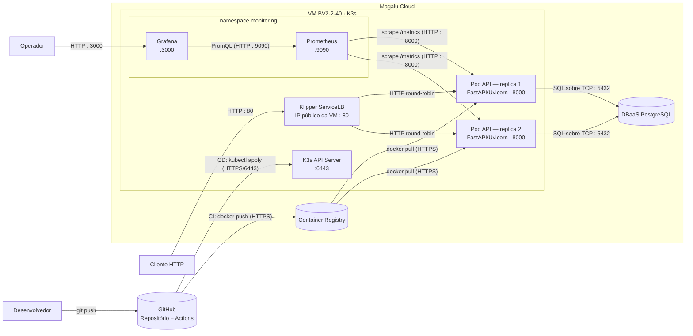

# Arquitetura da Solução

Este documento descreve a arquitetura da API de Pedidos implantada na Magalu Cloud (MGC): os componentes que a compõem, como se relacionam, os requisitos não-funcionais assumidos, o estilo arquitetural, os trade-offs de cada decisão e os próximos passos de evolução.

## Diagrama de arquitetura

- A **VM** (K3s single node) é a fronteira que contém o control plane, o `Klipper ServiceLB`, os pods da aplicação e a stack de monitoramento (namespace `monitoring`) — todos compartilham os 2 GB de RAM do nó.
- O **DBaaS PostgreSQL** é um serviço gerenciado da MGC, externo à VM mas interno à nuvem da Magalu.
- O **GitHub** (repositório + Actions) é totalmente externo à Magalu Cloud — ele só se comunica com ela via HTTPS, tanto para publicar imagens no Container Registry quanto para aplicar os manifests via `kubectl`.
- O **Prometheus** descobre os pods da aplicação através de um `ServiceMonitor` que seleciona o Service por label e resolve o endpoint pela porta nomeada (`http`).

## Componentes da arquitetura

| Componente | Serviço MGC | Função |
|---|---|---|
| API | K3s (VM single node) — 2 réplicas | Processa as requisições HTTP |
| Banco de dados | DBaaS PostgreSQL | Persiste pedidos e itens |
| Imagens | Container Registry | Armazena versões da aplicação (tag = SHA do commit) |
| Tráfego externo | Klipper ServiceLB (IP da VM, porta 80) | Distribui entre as réplicas e fornece acesso externo |
| CI/CD | GitHub Actions | Automatiza testes, build e deploy |
| Monitoramento | kube-prometheus-stack (Helm, namespace `monitoring`) | Coleta métricas (Prometheus) e exibe dashboards (Grafana, porta 3000) |

## Requisitos não-funcionais

| Requisito | Como medir | Alvo |
|---|---|---|
| Disponibilidade | Erros 5xx e uptime das probes no Grafana | 99,5% mensal |
| Latência | `histogram_quantile(0.95, ...)` do `/metrics` | P95 < 500 ms |
| Escalabilidade | Teste de carga (k6) + `rate(http_requests_total)` | 300 req/s sem degradar — [não atendido na configuração atual](load-test.md) |
| Custo | Simulação na calculadora MGC (ver ADR 001) | Teto: R$ 250/mês |

## Estilo arquitetural

A solução segue um **monolito em camadas** (apresentação → serviço → dados), implantado como **container único com duas réplicas** por trás de um balanceador (Klipper ServiceLB). Não há decomposição em microsserviços: todas as rotas (`/orders`, `/orders/{id}/items`, `/health`, `/stats`) vivem no mesmo processo FastAPI e compartilham o mesmo banco.

**Estilo-alvo**, caso o domínio de notificações (ex.: e-mail/SMS ao cliente quando o pedido muda de status) cresça em complexidade, seria extrair um segundo serviço dedicado a notificações, comunicando-se com a API principal de forma assíncrona (fila/mensageria), evoluindo de monolito para um conjunto pequeno de serviços especializados.

## Melhorias implementadas sobre o projeto base

Além do escopo definido pelo curso, as seguintes melhorias foram implementadas:

- **Imagem versionada pelo SHA do commit** em vez de `:latest` — correspondência exata entre código e artefato em execução, rollback determinístico via `kubectl rollout undo` ([ADR 003](adr/003ci-cd.md))
- **Container com usuário não-root** e **`.dockerignore`** — redução da superfície de ataque e do contexto de build, evitando que credenciais vazem para dentro da imagem
- **Service com label e porta nomeada** — correção necessária para o `ServiceMonitor` descobrir os endpoints de métricas (o template original resolvia 0 targets)

## Trade-offs

| Aspecto | Decisão tomada | Alternativa não escolhida | Motivo da escolha |
|---|---|---|---|
| Deploy | K3s em VM | MKS (Kubernetes Gerenciado) | Custo menor, provisionamento < 2 min, manifests idênticos |
| Banco | DBaaS gerenciado | PostgreSQL em container | Backup automático, sem administração |
| CI/CD | GitHub Actions | Deploy manual | Consistência e rastreabilidade |
| Réplicas | 2 pods | 1 pod | Disponibilidade mínima sem custo excessivo |
| API | FastAPI (Python) | Node.js, Go, Java | Curva de aprendizado baixa, alta produtividade |
| Observabilidade | kube-prometheus-stack no próprio cluster | SaaS (Grafana Cloud, Datadog) | Custo zero de licença; em contrapartida consome memória da VM de 2 GB |
| Versionamento de imagem | SHA do commit | `:latest` / semver manual | Tag única e automática por commit; semver fica como evolução para releases |

## Pontos de melhoria

### Escalabilidade

A aplicação é **stateless**, então escala na horizontal — mais réplicas atrás do balanceador. Hoje são 2 réplicas fixas; o próximo passo natural é o **HPA (Horizontal Pod Autoscaler)**, que ajusta esse número automaticamente pela utilização de CPU (ex.: mínimo 2, máximo 6, alvo de 70%). Vale registrar também que mais réplicas não resolvem um gargalo de banco — o PostgreSQL escala na vertical e costuma saturar primeiro.

### Limitações conhecidas

- **Single point of failure:** control plane, aplicação e monitoramento compartilham uma única VM — a queda do nó derruba tudo. Mitigação: migração para MKS quando HA for requisito.
- **Uma porta 80 por IP:** o Klipper ServiceLB expõe LoadBalancers no IP da própria VM; serviços que disputam a mesma porta conflitam (motivo do Grafana na 3000). Num LoadBalancer gerenciado, cada Service teria IP próprio.
- **Sem TLS:** todo o tráfego externo é HTTP puro.
- **Memória disputada:** a stack de monitoramento consome parte relevante dos 2 GB do nó, limitando o headroom da aplicação.
- **Pull secret manual:** a credencial do Container Registry no cluster é criada fora do pipeline; a recriação da VM exige reaplicá-la manualmente.

### Próximos passos naturais

| Melhoria | Por quê |
|---|---|
| HTTPS / TLS | Toda API em produção deve ser acessada por HTTPS |
| Autoscaler (HPA) | Escala automaticamente conforme a carga |
| Versionamento de API | `/v1/orders` permite evoluir sem quebrar clientes |
| Rate limiting | Evita abuso e protege o banco de sobrecargas |
| Cache (Redis) | Reduz consultas repetidas ao banco |
| Migrações de schema (Alembic) | Controle de versão das mudanças no banco |
| Testes de carga | Valida os alvos declarados nos requisitos não-funcionais |
| Ambientes separados (staging/produção) | Namespaces distintos + GitHub Environments com aprovação manual para produção |
| Provisionamento via Terraform | Estado versionado e reprodutível da infraestrutura (VM, Security Group, DBaaS) |
| Migrar para MKS | Quando precisar de HA real: basta trocar o kubeconfig — os manifests YAML são idênticos |

### Custo estimado na Magalu Cloud

| Recurso | Especificação | R$/mês |
|---|---|---|
| VM K3s | BV2-2-40 (2 vCPU, 2 GB) | 102,99* |
| DBaaS PostgreSQL | BV1-4, 15K IOPS, 10 GiB | 102,32 |
| Container Registry | 1 GiB | 0,29 |
| Tráfego de saída | Até 300 GiB (franquia) | 0,00 |
| **Total** | | **≈ 205,60** |

\* Cotação de instância 2 vCPU/4 GB usada como teto conservador para a BV2-2-40. Simulação de 09/08/2026; preços atualizados em https://magalu.cloud/precos/.

O comparativo com a alternativa não escolhida (MKS: ≈ R$ 535,60/mês, +160% pelo control plane gerenciado) está detalhado no [ADR 001](adr/001-kubernetes-deploy.md).

## Documentação relacionada

- [ADR 001 — K3s para deploy](adr/001-kubernetes-deploy.md)
- [ADR 002 — DBaaS PostgreSQL](adr/002-dbaas-postgresql.md)
- [ADR 003 — CI/CD com GitHub Actions](adr/003ci-cd.md)
- [Teste de resiliência — evidências](./resilience-test.md)
- [Teste de carga — validação dos RNFs](load-test.md)

## Referências

- [C4 Model — Diagramas de arquitetura](https://c4model.com/)
- [Diagrams as Code — Mermaid](https://mermaid.js.org/)
- [The Twelve-Factor App](https://12factor.net/pt_br/)