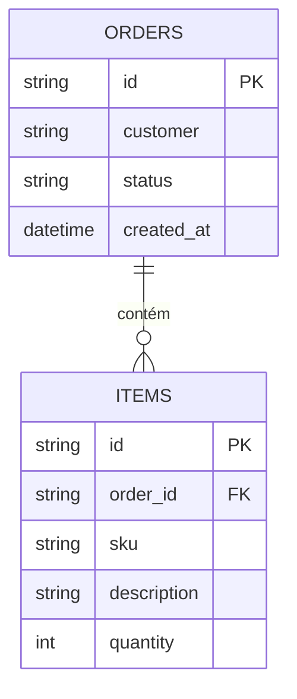

# Modelagem de Dados

Este documento descreve como os dados da API de Pedidos são organizados no banco de dados, definidos em `app/models.py` com SQLAlchemy.

## Entidades

### Pedido (orders)

| Coluna | Tipo | Descrição |
|--------|------|-----------|
| `id` | `String` (UUID) | Identificador único do pedido. Gerado automaticamente (`uuid4`) na criação. |
| `customer` | `String` | Nome do cliente que fez o pedido. Obrigatório. |
| `status` | `String` | Situação do pedido. Valor padrão: `"open"`. Inicia por padrão como open (`open`, `canceled`) |
| `created_at` | `DateTime` (com timezone) | Data e hora de criação do pedido, em UTC. Preenchido automaticamente. |

### Item (items)

| Coluna | Tipo | Descrição |
|--------|------|-----------|
| `id` | `String` (UUID) | Identificador único do item. Gerado automaticamente (`uuid4`) na criação. |
| `order_id` | `String` | Chave estrangeira que referencia `orders.id`. Indica a qual pedido o item pertence. Obrigatório. |
| `sku` | `String` | Código do produto. Obrigatório. |
| `description` | `String` | Descrição do produto. Obrigatório. |
| `quantity` | `Integer` | Quantidade do item dentro do pedido. Obrigatório. |

## Relacionamento

Um **Pedido** pode ter **vários Itens**, mas cada **Item** pertence a **um único Pedido** — um relacionamento **1:N (um-para-muitos)**.

- `cascade="all, delete-orphan"` em `Order.items` faz com que, se um pedido for excluído, os itens relacionados a esse pedido sejam excluídos juntos.

## Como as tabelas são criadas

As tabelas são criadas via SQLAlchemy através dos modelos de dados em /app/models.py onde estã definidas as tabelas e as colunas que seão criadas no banco de dados. Em app/main.py ao carregar a aplicação executa o comando `Base.metadata.create_all(bind=engine)` que cria todas as tabelas declaradas no modelo, atualizando apenas as tabelas que ainda não existem no banco de dados. Não é uma migration, mas atende bem os requisitos para aplicações de teste ou pocs em ambientes de desenvolvimento. 